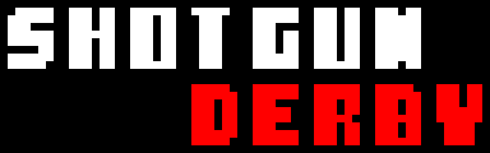
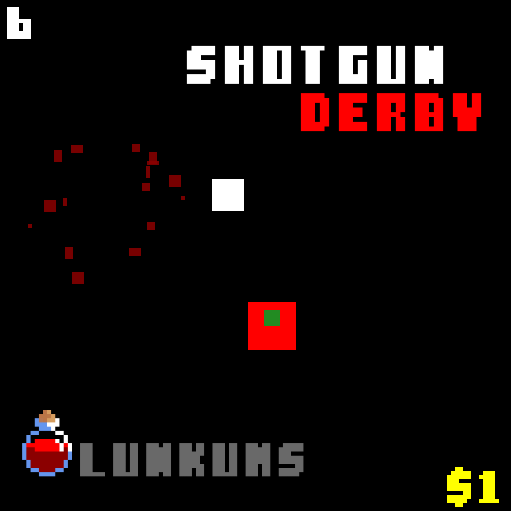

  

## About

SHOTGUN DERBY is an arena shooter where you mow down zombies with a shotgun and lob grenades to explode them to bits.  Every 10 seconds, a new wave of zombies spawns as the horde grows progressively larger. I didn’t have enough time to make coins useful or to add a dynamic arena, but I was able to spend a lot of time polishing the core gameplay.

The game was made in 48 hours for the Ludum Dare 51 game jam using MonoGame. I hope you enjoy it!

  

## Controls

- Move: WASD
- Shoot: Left Mouse Click
- Grenade: Right Mouse Click
- Select: Enter / Left Mouse Click
- Volume up/down: +/-
- Exit: Escape

## Credits

- JROB774, "Sharp Retro Font." opengameart.org, https://opengameart.org/content/sharp-retro-font.
- dasBUTCHER84, "SXP_SHOTGUN_RACK_01." freesound, https://freesound.org/people/dasBUTCHER84/sounds/449614/.
- Paracetamol, "Grenade pin pull then throw - sound effect." YouTube, https://www.youtube.com/watch?v=GLPefnYsrdU.

### Extras

If you want to mess around with some of the settings, go to the settings folder and open “settings.json.”
